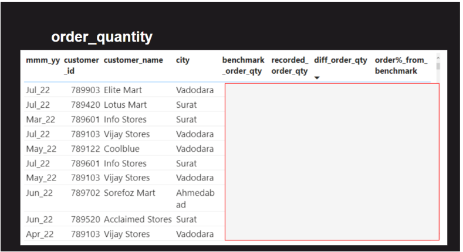
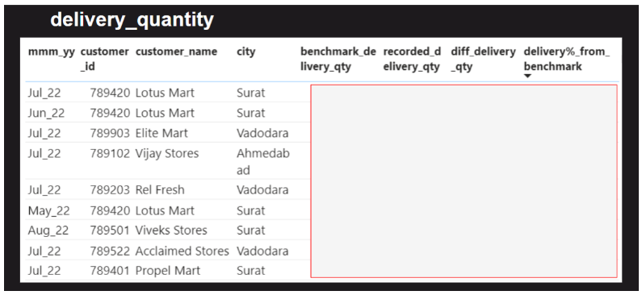
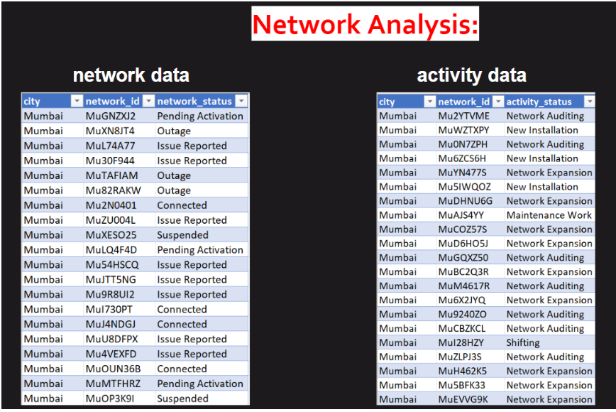
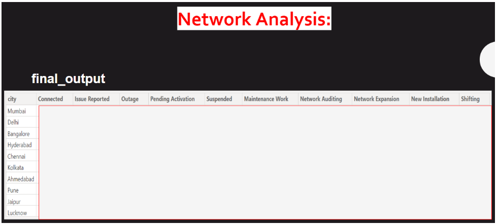
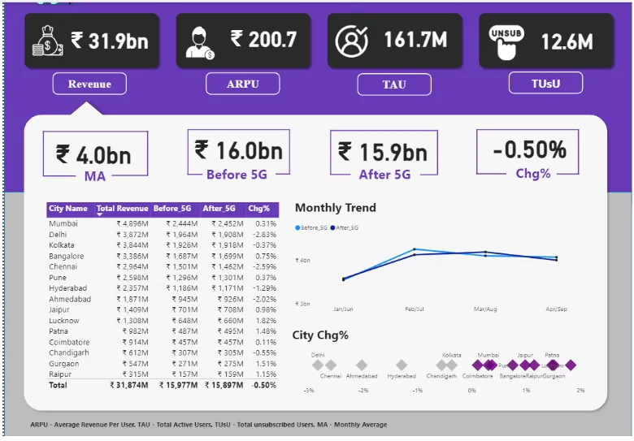

# 🧰 AtliQ Technologies Internship
As a Data Analyst Intern at AtliQ Technologies, I will work with experienced professionals to analyze data, create reports, and provide insights that will aid in making informed business decisions. This internship will be conducted remotely and will provide all the necessary tools and resources to help me succeed in this role.

## WEEK 1: 
> ### Task Email #1:
> #### HR REPORT
> Sending you these tasks following up on our call.
> The HR dataset can be found in the file [attendance_data.csv](https://github.com/BiQueryPls/AtliQTech_Internship/blob/main/attendance_data.csv). 
> Your tasks are divided into two parts: data cleaning and data analysis.
>
> #### **Task 1: Data Cleaning**
>
> 1. Check for duplicates in the dataset and remove them.
> 2. Standardize the date values to the format YYYY-MM-DD and extract the month name and day type from them.
> 3. Remove any extra characters, such as special characters, from the employee ID values. Some IDs may contain a '@' character at the end, which can be cleaned and brought to a common format.
> 4. Standardize the capitalization of names. Convert all names to title case, which means capitalizing the first letter of each word.  
> 5. Map the corresponding values in the status column with the given abbreviations:
> - Work From Office → WFO
> - Work From Home → WFH
> - Birthday Leave → BL
> - Menstrual Leave → ML
> - Paid Leave → PL
> - Sick Leave → SL
> - Weekly Off → WO
>
> #### **Task 2: Ad Hoc aka Analysis**
>
> 1. What is the total count of distinct employee names within the dataset?
> 2. Calculate the work-from-home (WFH %) percentage in the month of May.
> 3. Determine which day of the week had the highest attendance percentage in the month of June.
> 4. Find out the number of employees who had a WFH percentage greater than 10% in the month of April.
>
> You are free to use any tool of your preference, such as Pandas, Excel, PowerBI, etc., to complete this task.
>  Good luck with your task! 
>  Best regards, 
> 
>  Hem 
> Head of Data Analytics | AtliQ Technologies Pvt. Ltd.
>  Website: [www.atliq.com](https://www.atliq.com/) 

### Solution:
[Task 1: Internship_soln](https://github.com/BiQueryPls/AtliQTech_Internship/blob/main/Task%201%20Internship_soln.pbix)  
**Tool: Power BI**

> ### Task Email #2:
> #### DATA NORMALIZATION TASK
> Well done with the previous task. I have a new one for you.
>
> One of our client projects requires minor support. The dataset is currently in a de-normalized form, and we need your help to transform it into a normalized form.
>
> Your task will involve creating proper fact and dimension tables based on the dataset, which can be found in the [fact_order_lines.csv](https://github.com/BiQueryPls/AtliQTech_Internship/blob/main/fact_order_lines.csv) file.
>
> <b>Here are a few screenshots of the dataset to give you a better idea of what it looks like and how the final output should be presented:</b>
> #### Input Data:
> 
> 
#### Output Data:
> 
> 
>
>  Best regards, 
> 
>  Hem 
> Head of Data Analytics | AtliQ Technologies Pvt. Ltd.
>  Website: [www.atliq.com](https://www.atliq.com/) 

### Solution:

#### Quality Check
Q. What is the sum of the row counts for each of the three tables, dim_customers, dim_dates, and dim_products, when counted individually and then summed together?
i.e row_count(dim_customers) + row_count(dim_dates) + row_count(dim_products)
Note: Please note that the input should be a whole number. (ex: 520)

#### Answer: 236

[Task 2: Internship_soln](https://github.com/BiQueryPls/AtliQTech_Internship/blob/main/Task%202%20Internship_soln.pbix)  
**Tool: Power BI**

> ### Task Email #3:
> #### SCRUM TRAINING
> I’m forwarding the email from HR, in case it didn’t reach you.
>
> As part of your internship, we will be covering the SCRUM methodology in software development. SCRUM is a widely-used agile methodology that helps teams collaborate effectively to deliver high-quality software products.
>
> To help you gain a thorough understanding of SCRUM, I am pleased to introduce you to the SCRUM Training Series, available at https://scrumtrainingseries.com/. This is a comprehensive online training program that covers all aspects of SCRUM, from its basics to advanced concepts.
>
> It is mandatory for you to complete the SCRUM Training Series as having a good understanding of it will make you a more valuable employee in the industry.
>
>  Good luck with your task! 
>  Best regards, 
> 
>  Hem 
> Head of Data Analytics | AtliQ Technologies Pvt. Ltd.
>  Website: [www.atliq.com](https://www.atliq.com/) 

### Solution:
 Task 3: Scrum Knowledge: Passed with 100% 

## WEEK 2: 
> ### Task Email #1:
> #### VARIANCE ANALYSIS TASK
> Here is the detailed explanation of the task.
>
> You need to conduct variance analysis to compare benchmark data (benchmarks.csv) with their current data (fact_orders.csv). The goal of this analysis is to identify and quantify the differences or variations between the two datasets. Specifically, you will be comparing the order quantity and delivery quantity from the fact_orders.csv file with the benchmark data provided in the benchmarks.csv file.
>
> Datasets:
> You will be provided with three datasets for this analysis:
>
> 1. fact_orders.csv: Contains columns like order_id, order_placement_date, mmm_yy, customer_id, product_name, order_qty, and delivery_qty.
> 2. dim_customers.csv: Contains columns like customer_id, customer_name, and city.
> 3. benchmarks.csv: Contains columns like mmm_yy, customer_id, customer_name, city, total_order_quantity, and total_delivery_quantity.
>
> **Workflow:**
> Here is a brief overview of the workflow for the task:
>
> 1. Review the benchmark data and the current data (fact_orders.csv).
> 2. Metrics to compare between two files: Order quantity and Delivery quantity.
> 3. Calculate the variance (absolute value) between the benchmark data and the current data for the identified metrics.
> 4. Calculate the variance (in percentage) between the benchmark data and the current data for the identified metrics.
> 5. Provide a complete report of the difference in numbers between the benchmark data and the main data.
> Please ensure that you thoroughly analyze the datasets and provide a comprehensive report of the differences in the order quantity and delivered quantity between the benchmark data and the main data.
>
> Attaching screenshots from a dummy report I created, which will give you a better idea of what it looks like and how the final output should be presented:
>
> #### Output Data:
> 
> 
>
> Feel free to ask your seniors for any questions!
>
> Good luck with this task!
>  Best regards, 
> 
>  Hem 
> Head of Data Analytics | AtliQ Technologies Pvt. Ltd.
>  Website: [www.atliq.com](https://www.atliq.com/) 

### Solution:

#### Quality Check
Q1. Which customer_id has the largest absolute difference between their recorded order quantity and the benchmark order quantity?
i.e Absolute(benchmark_order_qty - recorded_order_qty)

#### Answer: 789903

Q2. How many customers in the delivery category have a difference of greater than 3% between their recorded delivery quantity and the benchmark delivery quantity, expressed as a percentage of the benchmark? i.e delivery%_from_benchmarks = ABSOLUTE((benchmark_delivery_qty - recorded_delivery_qty)) / benchmark_delivery_qty * 100

#### Answer: 5 customers

Q3. What is the quantity of orders recorded for “Viveks Stores” in the city of 'Vadodara' during the month of March 2022?

#### Answer: 73011

#### Solution File : [variance analysis_soln](https://github.com/BiQueryPls/AtliQTech_Internship/blob/main/variance%20analysis_soln.pbix)
**Tool: Power BI**

> ### Task Email #2:
> #### SQL QUERY DEBUGGING
> I’m struggling with something and need your help. We have some SQL queries created by our previous interns, and it seems they were not debugged. Can you debug them?
>
> I've provided you with the necessary files to get started. Please download the 'gdb080.sql' file and load it into your MySQL Workbench. You can then open the 'sql_queries.docx' file to view the list of queries that you need to debug. Each query has some errors that need to be identified and fixed. Please ensure that you test each query thoroughly after fixing the errors.
>
> This task is urgent – please complete it as soon as possible.
>  Best regards, 
> 
>  Hem 
> Head of Data Analytics | AtliQ Technologies Pvt. Ltd.
>  Website: [www.atliq.com](https://www.atliq.com/) 

### Solution:

#### Quality Check
Q1. How many unique customers are in the city of 'Surat'? 
#### Answer: 73011

Q2. What is the highest quantity available for the product 'AM Tea 100'?
#### Answer: 200

Q3. In which month were the unfulfilled orders the highest in number?
#### Answer: May

Q4. What is the percentage of the total order quantity accounted for by the 'food' category? (Submit answer in 2 decimals)
#### Answer: 12.50

Q5. What is the count of customers falling under the 'Above 90' category based on their ontime_target_pct?
#### Answer: 9

Q6. What is the count of distinct products available in the 'Dairy' category?
#### Answer: 12

Q7. What is the total order quantity (in millions) for the top 3 products in the Dairy Category? Q7. (Submit answer in 2 decimals)
#### Answer: 3.81

Q8. What is the OTIF percentage for the customer "Vijay Stores"?
#### Answer: 28.28

Q9. What is the count of products with an IF percentage greater than 67%?
#### Answer: 3

#### Solution File : [sql query debugging_soln](https://github.com/BiQueryPls/AtliQTech_Internship/blob/main/sql%20query%20debugging_soln.sql) | **Tool: MySQL**

> ### Task Email #3:
> #### REPORT AUTOMATION
> I have a quick ad-hoc task for you.
>
> One of our clients in the Network services domain is currently creating a weekly report manually. This process can be automated, and we can help them save time.
>
> I've provided you with two Excel sheets - [network_data.csv](https://github.com/BiQueryPls/AtliQTech_Internship/blob/main/network_data.csv) and [activity_data.csv](https://github.com/BiQueryPls/AtliQTech_Internship/blob/main/activity_data.csv), containing data related to our client's network operations. Your task is to use Power Query to manipulate and transform the data from these files and create a new table that meets the specified format.
>
> To achieve the desired format, you'll need to use a variety of Power Query techniques, such as pivoting, transforming, merging, and manipulating headers.

> #### Input Data:
> 
>
> #### Output Data:
> 
>
> Please complete this task as soon as possible. If you need any assistance, feel free to reach out to your seniors.

>  Best regards, 
> 
>  Hem 
> Head of Data Analytics | AtliQ Technologies Pvt. Ltd.
>  Website: [www.atliq.com](https://www.atliq.com/)  ### Task Email #4:
> #### INSIGHT PRESENTATION
> I’m sending the details to you as discussed in the call.
>
> You need to create a presentation from the dashboard for our telecom client 'wavecon'.
>
> Preview of the dashboard:
>
> 
>
> Your task is to analyze the dashboard and provide insights on a ppt that addresses the following questions:
>
> 1. What is the impact of the 5G launch on our revenue?
> 2. Which KPI is underperforming after the 5G launch?
> 3. After the 5G launch, which plans are performing well in terms of revenue? Which plans are not performing well?
> 4. Is there any plan affected largely by the 5G launch? Should we continue or discontinue that plan?
> 5. Is there any plan that is discontinued after the 5G launch? What is the reason for it?
>
> These are just initial questions to help you get started, and you are free to come up with new insights based on your analysis. You can also play around with the dashboard to get better insights.
>
> Of course, you can check with your seniors as usual.
>
> Looking forward to your best!
>
>  Best regards, 
> 
>  Hem 
> Head of Data Analytics | AtliQ Technologies Pvt. Ltd.
>  Website: [www.atliq.com](https://www.atliq.com/) 

#### Solution File : [Wavecon Telecom_PPT](https://github.com/BiQueryPls/AtliQTech_Internship/blob/main/Wavecon%20Telecom_PPT.pptx) | **Tool: Microsoft Powerpoint**

#### video link: [LinkedIn Internship Submission](https://www.linkedin.com/posts/sagarmurmuanalyst_codebasicsvirtualinternship-codebasicsvirtualinternship-activity-7414265093305225216-tyUt)

